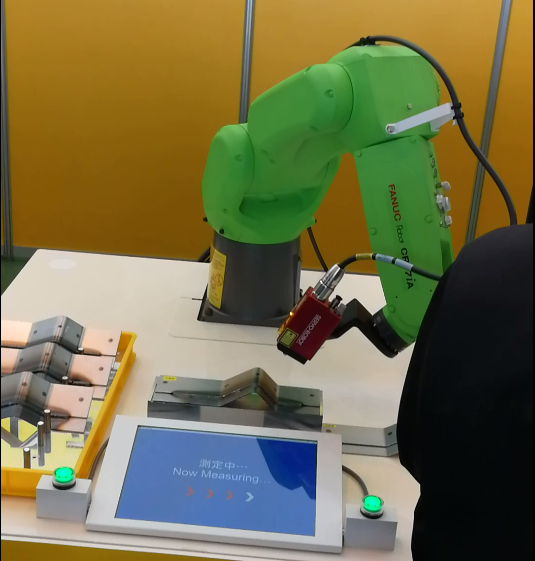
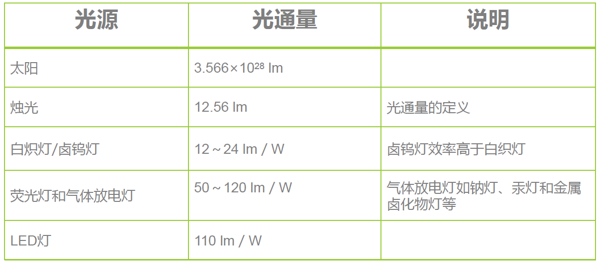

# 第一周作业

## 1.第一题：视觉系统构成要素

(1)光源：本图使用的光源为室内吊顶的灯光，未增加附加光源。
(2)相机：机械手前端的相机
(3)主机：嵌入式处理器（或台式计算机），控制柜中有专用视觉处理模块。
(4)算法软件：使用C++或其他语言编写的视觉识别算法及程序。

## 2.第二题：本课程的组织及理解
（1）视觉的目的就是通过视觉系统，重新构建物体的三维实体，以及位置等信息，为构建数字化的现实世界提供数据来源。

（2）以人类的视觉系统为例：

​        首先自然光线或者灯光充当了光源，照射物体反射的光进入人眼，被视网膜视神经捕捉，此处视神经起到了CCD相机中电容耦合器件的作用，把光信号转化为电信号，神经传导电信号进入大脑皮层的视觉处理区域，此处大脑皮层相当于运行视觉算法的主机，大脑神经网络处理电信号使人有了对色彩信息的感知最后构成了图像。

（3）第一本资料查找了冈萨雷斯的《数字图像处理》，本书图片示例，基本原理的公式、数学方法讲得很清楚，可以作为学习中补充理论知识的书籍。

​         第二本《机器视觉算法与应用》，算法及代码实现都有，而且是双鱼版本，可以借此机会熟悉相关英语表达。

​         以上两本书虽然略厚，但根据经验，实际遇到问题查阅基本原理时是往往只需要书中的一小部分，因此理论详实的书籍作为参考应该不错。其余的内容权当扩充自己的知识面。

## 3.第三题：光通量及辐照度

（1）光通量：

​         光通量指人眼所能感觉到的辐射功率，它等于单位时间内，某一波段的辐射能量和该波段的相对视见率的乘积。以符号Φ表示，单位是lm(流明)，1流明 = 0.00146 瓦。

（2）辐照度：

​         辐照度指投射到一平表面上的辐射通量密度。指到达一表平面上，单位时间，单位面积上的辐射能，以符号E表示。常用单位是lux(勒克斯)，1 lux = 1 lm / m2。

## 4.第四题：HSI颜色空间

（1）HSI定义：

​        色调H (hue)是描述纯色的属性（如红色、黄色等）;
​        饱和度S (Saturation)表示的是一种纯色被白光稀释的程度的度量;
​         亮度I(Intensity)体现了无色的光强度概念，是一个主观的描述。

（2）HSI和RGB颜色空间的个人几何理解：

​         如下图的RGB颜色空间，分别以R、G、B三个顶点连线，做过体心的等边三角形

则该等边三角形即为HSI颜色空间的中间HS平面。以W、B两点做体对角线，该连线即为I轴。因此可以说HSI模型与RGB模型只是在几何形状上略有差别？（个人理解）。

（3）HSI各通道的物理意义

如上图，第二行从右至左，分别为H、S、V三个通道的灰度图像。首先H通道因为红色的值为0，灰度图像显示为黑色，G值较B小所以颜色深一些。饱和度RGB三种颜色为纯色，饱和度拉满，值最大，灰度图像显示为白色。V通道三种颜色的及背景的亮度都是最大，因此均显示为白色。

## 5.第五题：彩色图像传感器及γ校正的基本原理

（1）彩色图像传感器：

​       CCD相机的每个点接受光照，强弱不同的光产生强弱不同的电流，因此区分了图像的明暗。但能够充分感应实际色彩的技术尚未突破，所以工程师在对应光感单元之上增加滤光片，R:G:B_25%：50%：25%,每个滤光片对应一个集光透镜。采集道的颜色信号以Bayer点阵的方式线性排列，每个点整取值R G  B(类似于晶体学中计算一个晶胞中原子数量)组成一个个以为数组排列（数据量：长度方向上传感器个数×列方向个数×3Byte）。

（2）γ校正：

​        个人感觉课程视频中说得稍微不清楚，来龙去脉未说清，找了一个感觉自己能看明白的版本。https://blog.csdn.net/w450468524/article/details/51649651

​       总结说来，就是显示器显示与摄像机采集（人眼看到）值之间存在偏差，可以用一个指数函数的形式表示（采集值的gamaa次幂），因此在摄像机采集图像后需要乘以1/gamma次幂来对数据进性修正，防止显示时图像失真。