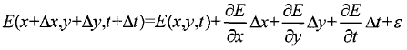
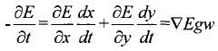

# 第三周作业

## 1.混合高斯模型

### 1.1混合高斯模型的基本思想

​        高斯混合模型，英文全称：Gaussian mixture model，简称GMM。高斯混合模型就是用高斯概率密度函数（二维时也称为：正态分布曲线）精确的量化事物，将一个事物分解为若干基于高斯概率密度函数行程的模型。即可以理解为，现实的实物进行定量化的描述时，其物理规律总能够用一组曲线描述，而一条曲线无论多么复杂，我们都可以用若干个高斯曲线来无限逼近它，这就是高斯混合模型的基本思想。参考http://blog.sina.com.cn/s/blog_a36a563e0102y2ec.html。

### 1.2 通过混合高斯模型进行背景建模的基本思想

​      对于一组视频的每一帧中的每一个像素值的分布趋近于正态分布（帧数为横轴，纵轴为灰度值），可以将均值3σ的区域看作是对背景检测的控制上下限。此处可以结合日常接触的品控（SPC统计过程控制）来理解——连续生产的产品尺寸要分布在一个合理的尺寸区间，超出控制区间即为不合格品。即在3σ区域内的合格品可以看作是背景，超出控制界限的不合格品聚集即为运动目标。
   建模过程借用课件表达：
（1）模型初始化 将采到的第一帧图像的每个象素的灰度值作为均值，再赋以较大的方差。初值Q=1, w=1.0。
（2）模型学习 将当前帧的对应点象素的灰度值与已有的Q个高斯模型作比较，若分布在2.5σ的范围内 ，则按上页方式调整第q个高斯模型的参数和权重；否则转入(3)。
（3）增加/替换高斯分量，若不满足条件，且q<Q，则增加一个新分量；若q=Q，则替换。
（4）判断背景 设定一个总权值T，按照降序，每一项的权值w和累加小于T的项为背景，否则为前景或者噪声。
（5）判断前景
## 2.光流估计
###  2.1恒定亮度假设

​       即同一目标在不同帧间运动时，其亮度不会发生改变。这是基本光流法的假定（所有光流法变种都必须满足），用于得到光流法基本方程；参考https://blog.csdn.net/qq_41368247/article/details/82562165。

### 2.2 L-K光流估计方法的基本原理

​      假设图像上一个像素点(x,y)，在t时刻的亮度为E(x+Δx,y+Δy,t+Δt)，同时用u(x,y)和v(x,y)来表示该点光流在水平和垂直方向上的移动分量：u=dx/dt、v=dy/dt。
​      在经过一段时间间隔Δt后该点对应点亮度为E(x+Δx,y+Δy,t+Δt),当Δt很小趋近于0时，我们可以认为该点亮度不变，所以可以有：E(x,y,t)=E(x+Δx,y+Δy,t+Δt)。
​     当该点的亮度有变化时，将移动后点的亮度由Taylor公式展幵，可得：

​      

忽略其二阶无穷小，由于Δt趋近于0时，有：

式中w=(u,v)，所以上式就是基本的光流约束方程。

其中令

表示图像中像素点灰度沿x，y，t方向的梯度，可将上式改写成:

Lucas-Kanade是一种广泛使用的光流估计的差分方法，这个方法是由Bruce D. Lucas和Takeo Kanade发明的。它假设光流在像素点的邻域是一个常数，然后使用最小二乘法对邻域中的所有像素点求解基本的光流方程。
通过结合几个邻近像素点的信息，卢卡斯-金出方法(简称为L-K方法)通常能够消除光流方程里的多义性。而且，与逐点计算的方法相比，L-K方法对图像噪声不敏感。不过，由于这是一种局部方法，所以在图像的均匀区域内部，L-K方法无法提供光流信息。
原文链接：https://blog.csdn.net/u014568921/article/details/46638557

