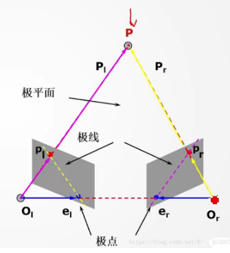

# 第九周

## 问题

1. 试画图说明极线几何关系，并指出极点、极线所在，解释极线约束。
2. 结合本质矩阵的定义，说明本质矩阵的意义，同时思考与上一周中平面点对应透视矩阵的区别。
3. 说明三维重构的步骤，并指出输入及输出要求。
4. 说明特征匹配的步骤，进一步说明基于k-d树的特征匹配方法的思路。
5. 说明RANSAC方法的基本思想及实施步骤

## 1.极线几何

​       首先极线几何表达了两个相机（或同一相机两个不同时刻）和被观测特征点之间相对位姿的集合关系约束。

​       相机光心、特征点三点构成了极平面两，而两相机的相平面与极平面的交线为极线，左右相机的连线称为基线，基线与相平面的交点就是极点。

## 2.本质矩阵

本质矩阵是旋转矩阵与平移矩阵叉乘的结果，反应的是左右两个成像平面之间的几何变换关系。

透视矩阵是将一个空间点变换为另一个空间点，而极线几何一个空间点对应另一个相机中的一条线。

## 3.三维重构的步骤

1.提取特征点没建立特征匹配；

2.计算视差；

3.计算世界坐标；

4.三角剖分；

5.三维重构

输入是前后（左右）两张图片的特征点匹配信息，而后得到特征点的视差图，最终计算得点的三维数据。