# 第二周作业

## 1.第一题 图像预处理滤波

### 1.1图像卷积的含义

​         图像的卷积滤波以模板的形式定义（通常给定3×3或5×5的卷积模板），该模板从需要卷积滤波的图像一边开始滑动，计算图像与模板中对应像素数值的乘积和，则为输出滤波图像的一个像素值，如下图所示。通过改变模板中的数值，会突出取到的每个位置特定部位的影响，突出该部位的特征。

​         同时我们也能直观看出，图像的卷积滤波会丢掉原图中的一部分信息。

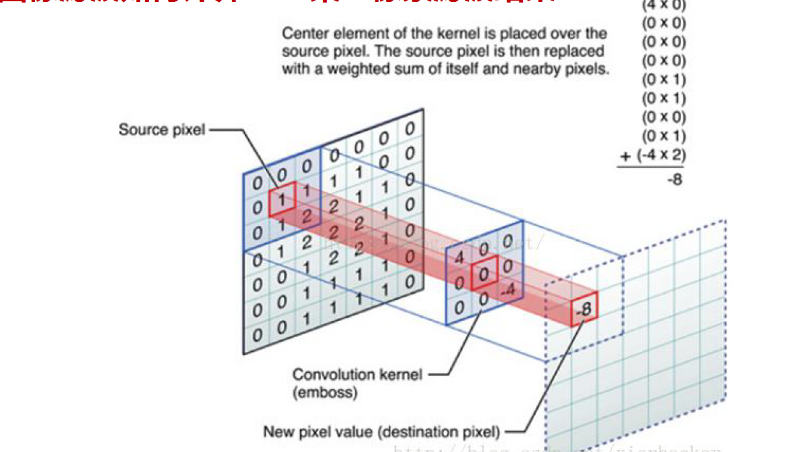

### 1.2几种常见的平滑滤波算法

（1）平均滤波：在3卷积模板中，所有权值均为1，或中心点边缘点的部位为0。

（2）加权平均滤波：可以看作上一个的升级版，通过对中心点的权值增加，滤波时突出了中心点的作用。其中最常用的为高斯模糊模板，其卷积模板设置为草帽形。

（3）中值滤波：选定奇数个数目的窗口，将该窗口中所有像素的值从大到小排列，取该序列的中值替换原窗口中中心点的值。

​          该算法对椒盐噪声有效，个人理解为椒盐噪声往往只占有限几个像素，因此中心值被替换后噪点明显被淡化、消除。

（4）图像形态学滤波：以数学图像形态学操作为基础，基础运算分为膨胀和腐蚀，理解为对指定的图像，以给定锚定点的基础图像所有像素的方向为扩张/收缩的方向。

​          由此定义先腐蚀后膨胀为开运算，先膨胀后腐蚀为闭运算。执行先开后闭的操作可以有效滤除噪声。

## 2.第二题 边缘检测

### 2.1图像边缘检测的基本原理

​        图像边缘检测是基于微分的思想——当被检测的图像出现灰度变化时，即代表图像出现了色彩及明暗的变化，此时对于两个 不同状态的区域必然存在边界，对边界处的灰度变化函数求微分，一阶导数必然存在极值点，二阶导数存在零点，因此就判定该位置为二者的交汇点。

​        实际应用中由于数字图像的特性——以像素为单位所以常见推导中Δx=1，采用离散的差分来计算。

### 2.2sobel算子：

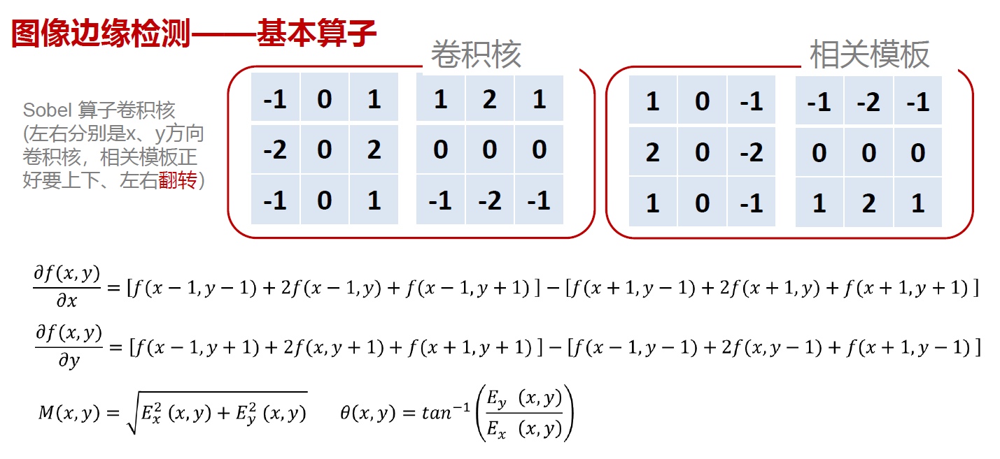

sobel算子采用求一阶导数极值的方法求取边缘（即通过求取梯度的幅值+边缘方向，基本的数学原理经查资料大致如此https://blog.csdn.net/qq_37124237/article/details/82183177，但具体的算法工程实现目前尚未研究，待有时间再说）。

### 2.3Laplace算子

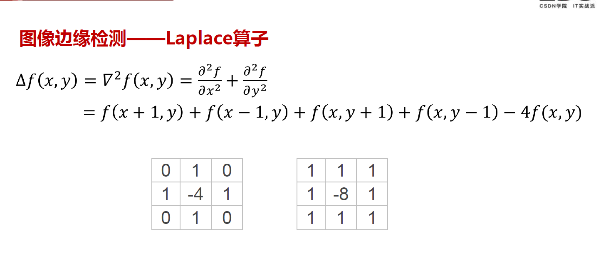

​         本质是通过求取边缘灰度变化的二阶导数零点确定边缘，但对噪声过于敏感，导数阶数越高越敏感。

### 2.4LoG算子：

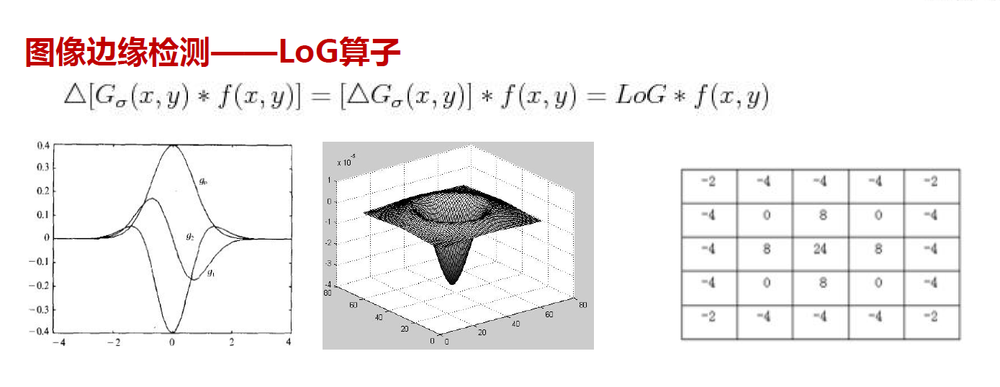
​         LoG算子的基本原理是，既然二阶导数对噪声敏感，拿么就先对图像进性高斯平滑后再检测边缘。具体实现时（数学过程不懂），等价于先对高斯函数进性拉普拉斯变换再和图像卷积。

### 2.5Canny算子：

以上的算子所存在的局限有：对噪声敏感、断裂的边缘无法检出、灰度渐变时无法计算出具体的边缘。

所以针对以上的不足设计Canny算子，分为以下几步:

①平滑图像同时计算微分

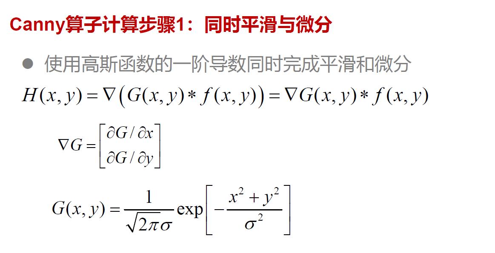

核心思想是先对图像进行高斯平滑滤波，再计算其一阶导数。等价于先对高斯函数计算偏微分，再和图像卷积。

②计算梯度(幅值和方向)

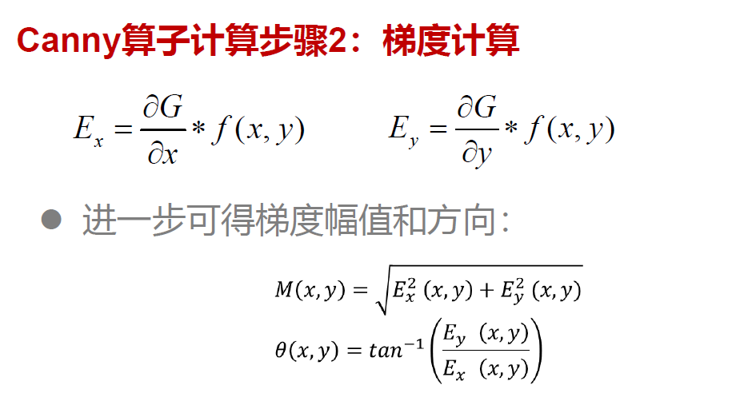

对于第一步卷积后的结果计算梯度的幅值和边缘方向，为下一步的梯度的非极大值抑制准备。

同时将计算得到的角度对应模板进行离散化处理。

③梯度幅值进行非极大值抑制

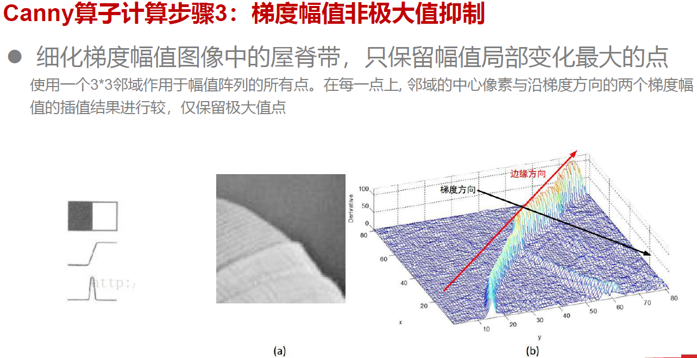

 由于边缘往往是渐变的情形，针对一个像素求得梯度的幅值后，跟其对角相邻的两个梯度比较（取同边缘方向上的值），保证取得局部的极大值，有效的消除了因超过设定阈值造成虚检的情况。

④自动边缘连接

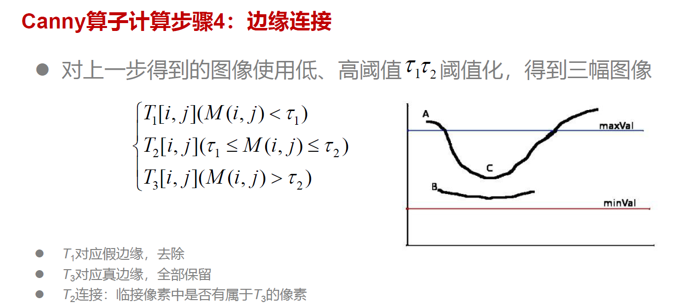

设定高低两个阈值，低于最小值得一定不是边缘，大于高阈值得一定是边缘，介于二者之间的需要判断与该像素临接的像素是否有高阈值像素，如果是则判定为边缘，因此一写相对比较虚的，看起来对比度不强的边缘能够被自动连上（吐槽一下这里的自动连接，还不够智能，按照求梯度根据幅值+阈值检测的算法，大段的边缘中断，该算法应该也是自动连接不上的，还是比真正的人类脑补差。。。。。。。）

## 3.图像直方图和大津算法

### 3.1图像直方图

​        灰度直方图的概念比较简单，就是对于一幅图像，做其每个像素灰度的统计，统计灰度在[0,255]的区间上的分布频度。

### 3.2大津算法

​       大津算法是进行图像分割的一种算法，其核心思想就是：一张照片从整体来看是会分为前景和背景，二者的区域对应不同的灰度集中分布。因此我们需要找到这两个集中分布区域的分界点，以此作为阈值分界点，对图像进行二值化处理。

​       因此大津算法的核心就是找到该阈值——通过计算类间方差的办法：

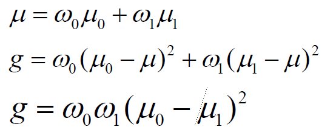

对于求函数g的最大值，因为数学上不容易实现，实际操作中直接带入[0,255]之间的254个数进行运算即可，对应得值即阈值μ,根据阈值μ对图像进行二值化处理。

​       根据μ对图像进行二值化。因为大津算法是一个针对全局描述的算法，所以对一写前景背景区分度较高的图片有效，但对存在光影渐变较多的图片则不理想。

## 3.3 Harris算子

### 3.3.1 Harris算子的角点检测

​        根据检测窗口内灰度值积分的变换剧烈程度来，衡量是否是角点，在平缓区，灰度积分值近似保持不变。在边缘方向灰度积分值不变，其他方向剧烈变化。在角点处任意方向均剧烈变化。

​        其中变化程度用移动前后的，每个子区域内灰度差值的和来表示。

​       具体算法是通过构造移动前后的面积差值函数，通过泰勒展开，可以近似构造出面积变化的函数是一个二次型的形式，观察二次型的形式是一个倾斜的椭圆，因此长短轴的长短决定了椭圆的大小，即面积变化的大小。转化为求二次型矩阵的特征值。

​          但是由于图像的明暗等因素的影响，造成求取的λ值大小不好确定，因此引入了角点响应函数通过函数值的正负，判断λ之间的大小关系。

## 3.4Hough变换和直线检测

### 3.4.1Hough变换的理解

​         首先参考了这篇文章https://blog.csdn.net/qq_15971883/article/details/80583364，对Hough变换的坐标空间转换讲解得很详细。根据自己理解如下：

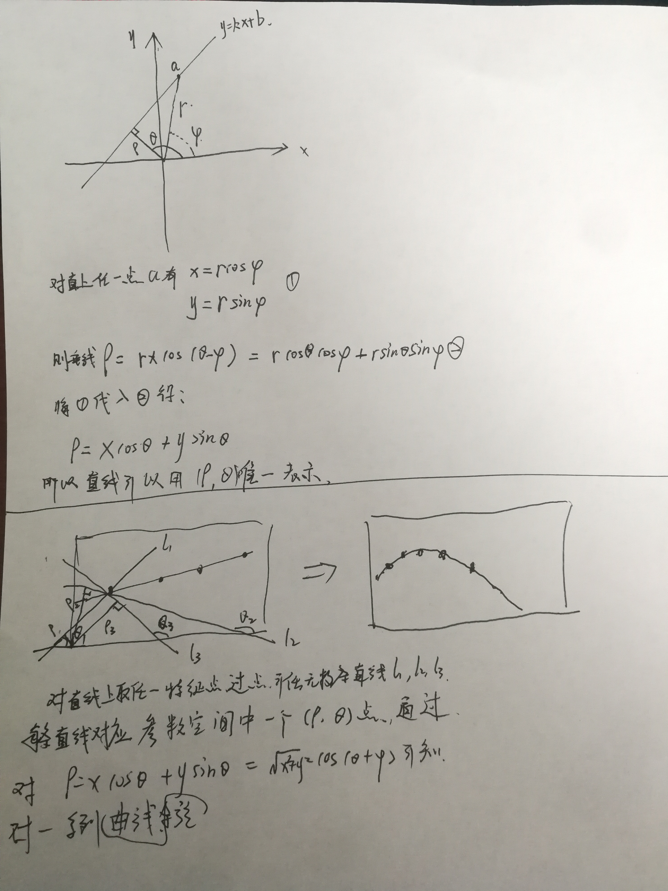

​         总之定性的理解Hough变换就两句话，直角坐标系一点对应极坐标系一条曲线，直角坐标系一条直线对应极坐标系一点。

​         所以当一幅图像检测出很多特征点后，将这些特征点都转换到极坐标空间，则多条曲线的交点对应指教坐标系中的一条直线。

### 3.4.2 网格统计

​        应用上述原理将（ρ，θ）空间划分为许多小格，计算（x,y）对应的（ρ，θ）值，并在相应的格子里计数。统计完所有特征点的数值后，统计每个格子里的计数值，大于我们设定值T的点我们就认为对应一条直线，带入公式计算出直角坐标系中的直线方程。

## 4 Sift及其实现原理

### 4.1 基本思路
（1）尺度空间极值检测；

（2）关键点定位

（3）方向确定

（4）关键点描述

一下描述均结合课程及https://blog.csdn.net/u010440456/article/details/81483145，摒弃全部的数学推倒，尽力先理解其基本表达。

#### 4.1.1尺度空间极值检测：

​       首先从流程上讲：高斯滤波获得尺度空间上的高斯金字塔——DOG差分算子检测空间尺度的关键特征点

（1）尺度空间相关概念

​       **基本思想**：在图像信息处理模型中，引入一个被视为尺度的参数，通过连续变化尺度参数获得多尺度下的尺度空间表示序列，对这些序列进行尺度空间轮廓的提取，并以该轮廓作为一种特征向量，实现边缘、角点检测，和不同分辨率上的特征提取。简单来说，之前的边缘检测算子，角点检测算子只是在单一尺度上进行特征的提取，但通过加入尺度空间模仿人的眼睛，更准确的提取目标的特征。

​       尺度空间的形成首先需要高斯滤波实现，至于为什么需要高斯滤波——SIFT需要生成线性的高斯金字塔来对不同尺度上的关键点查找并比对，而高斯滤波已被证明时唯一尺度变换的唯一变换核，并且是唯一线性核。

​       **尺度空间表示——高斯金字塔的构建：**

第一步:对图像做不同尺度的高斯模糊

第二步：每一组第一幅图像由上一组的倒数第三张图像做间隔为1的降采样得到，为的是保证图像大小与尺度是等比例变化。

#### 4.1.2关键点定位：

​         由于检测到的点是在离散空间中做差值得到的极值点，所以在连续空间中不一定是极值点，所以为了求极值就需要求导，对DOG函数进行拟合（数学原理不管）成连续形式，然后求导，求零点。得到的零点X坐标（偏移量）带回原方程式求得极值D(x)。如果求得的X（偏移量）大于 0.5时，则意味这该极值已经偏移到临近像素点，3.此时需要根据新的位置重新插值拟合，直到偏移值收敛。超出设定迭代次数的点（说明偏移过大）需要删除，同时D(x)的绝对值小的点（小于0.03）容易受噪声干扰，也应舍去。

​       同时由于DOG函数对于边缘的响应敏感，所以还需要通过数学方法 消除边缘相应。

#### 4.1.3关键点方向分配

​       生成方向直方图：

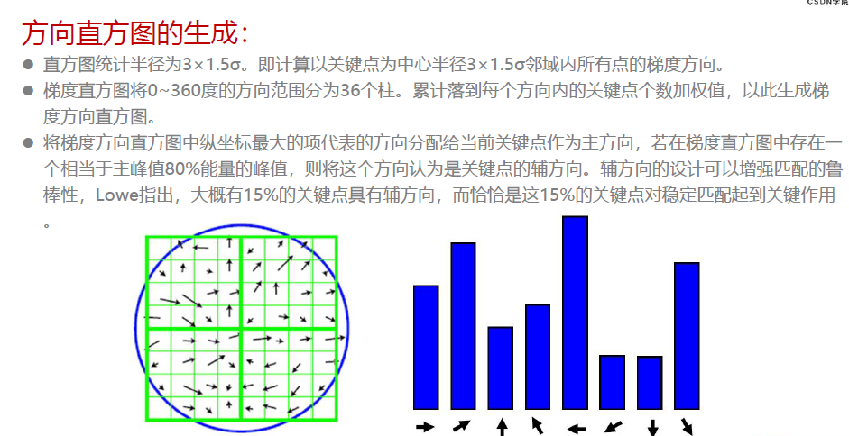

#### 4.1.4关键点的特征描述

经过以上三个步骤，对于每个关键点已经有了位置、尺度、方向三个信息，接下来就需要根据这仨信息为每个关键点创建一组描述。

1.首先确定描述子的区域：

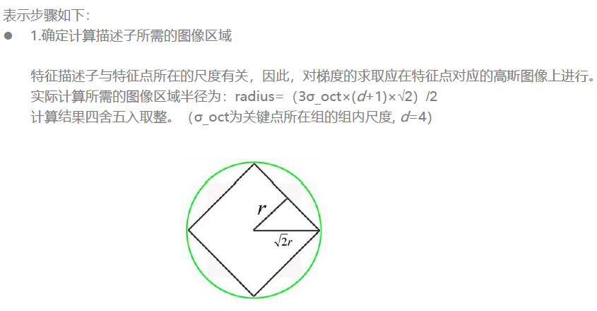

2.然后将求得的关键点坐标旋转到关键点的主方向上，确保其旋转不变性。

3.将采样点分配到对应子区域，将子区域的梯度值分配到8个方向上，计算权值。

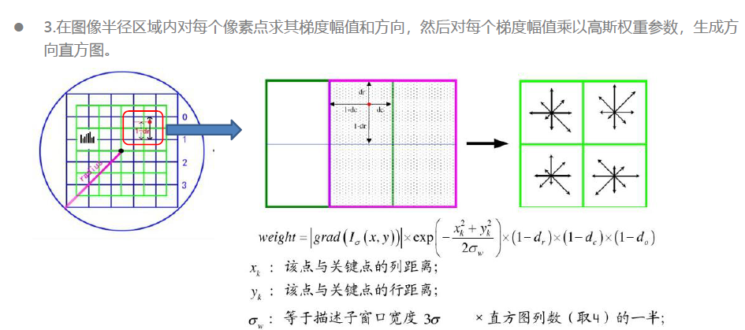

4.插值计算每个种子点八个方向的梯度。

5.归一化处理共128个向量

6.描述子向量门限

7.按照尺度特征对特征描述向量排序。

## 5 ORB算

### 5.1 FAST特征点提取

​     1.判断特征点：从图像中选取一点P，以P为圆心画一个半径为3像素的圆。圆周上如果有连续N个像素点的灰度值比P点的灰度值大或小，则认为P为特征点。这就是大家经常说的FAST-N。有FAST-9、FAST-10、FAST-11、FAST-12，大家使用比较多的是FAST-9和FAST-12。

​     快速算法：为了加快特征点的提取，快速排出非特征点，首先检测1、5、9、13位置上的灰度值，如果P是特征点，那么这四个位置上有3个或3个以上的的像素值都大于或者小于P点的灰度值。如果不满足，则直接排出此点。

​     进一步利用机器学习算法（这一块儿不了解，赶作业没细查），训练决策树，用于其他图像的fast特征检测。

​    2.进一步进行特征点周围邻域的非极大值抑制，保证每一个特征区域内特征点的唯一性。

​    3.使用矩来确定特征点的方向——特征点与特征点周围区域的质心的连线方向。

### 5.2 BRIEF特征点描述

​         在选中每个特征点的邻域内，按照（0，S^2/25）的高斯分布选取p、q两个点，如果p的灰度值大于q，则记1，反之记0，通常选择生成一串256位的描述子来刻画一个特征。

​        但BRIEF对旋转的的描述不好，大于30°时匹配率降低至0.改进算法rBRIEF，就是对旋转过的图像扩大特征点的搜索范围（31*31），根据大量的数据中匹配256个相关性最高的特征描述子。