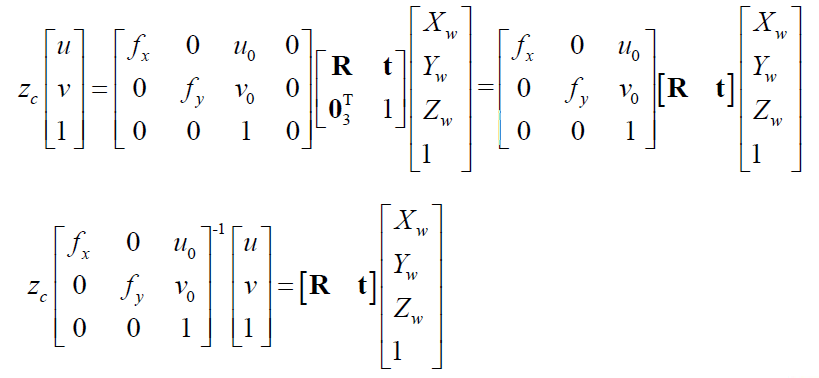

# 第八周

## 问题

1. 简述仿射变换和透视变换的基本概念，并用实例说明。
2. 结合图简述图像坐标系、相机坐标系和世界坐标系的定义，并说明三者之间的变换关系。
3. 什么是相机的内、外参数矩阵？实际中你能结合身边的实例(如电脑摄像头、手机镜头)说明这些参数的大致值么？
4. 说明使用线性法求解相对位姿时的要求输入和输出，以及求解的基本思想。
5. 说明使用Zhang方法进行相机标定需要的输入条件和得到的具体输出量，以及Zhang方法的主要步骤

## 1 仿射变换和透视变换

### 1.1仿射变换

​        对于一副图像，我们熟悉的操作有放缩、旋转、平移三种操作，而这三种操作均可对应的数学操作为数字图像矩阵，左乘上对应的变换矩阵。仿射变换就是将三种操作由一个变换矩阵完成的变换操作。可以理解为仿射变换是平移、旋转、放缩的一般形式。

​       例如：相机对工厂环形传送带上的工件进行视觉追踪定位，此时工件运动的每一帧图像满足仿射变换。

### 1.2 透视变换

​       个人理解透视变换与美术上的透视是同一道理，人或传感器在观测目标时，由于人眼与物体并不是绝对平行，因此入射光线最后汇聚于人眼的一点，产生了近大远小的错觉，并不能真实反映物体的尺寸。

​     例如：公路开车时，看远处的公路似乎汇聚在一起。

## 2.图像坐标系/相机坐标系/世界坐标系

​        这一块看了好久才理清思路，以下结合https://blog.csdn.net/weizhangyjs/article/details/81020177    来阐述一下自己的理解。

​      首先课程里老师分别给出了像素坐标和图像坐标的图片，看了好久结合上面文章才恍然醒悟，二者之间原来就是一个简单的平移变换，以及坐标尺度的比例变换，说白了就是仿射变换，so easy!

将上式像素坐标系u、v，与图像坐标系x、y之间的关系用矩阵的方式写出来就是：

### 2.2相机坐标系和世界坐标系

这二者之间的关系就挺好理解，可以用旋转矩阵R和平移矩阵t来表示,二者之间满足刚体的变换：

因为涉及xyz,所以R为3×3的矩阵，T为3×1的矩阵。

#### 2.2.1成像原理

相机坐标系的原点与所成像之间的距离为焦距f,这里成像应该是倒像，这里使用了对称的正像来计算。

所以图像中的坐标x/y,与世界相机坐标系之间的比例关系如下(如图所示，相似三角形原理)：

进而写成矩阵形式，因为不存在平移，所以左后一列为0向量。

以上我们得到了 像素——图像坐标系、图像——相机坐标系、相机——世界坐标系的关系，因此综合一下，有下面的关系。

上图等式两边同时乘以1/Zc，可以得到像素到世界坐标系的参数转换关系。等式右边世界坐标系左乘的三个矩阵统称为投影矩阵（M），其中左边两个与相机像素宽度和焦距两个参数相关的可以和二为一，统称为相机的内参数矩阵（M1），如下所示：

而对应旋转平移变换的矩阵称为相机的外参数矩阵（M2），如下所示：

目前我们用的手机摄像头动不动就几千万像素，fx,fy应该是小得令人发指......

## 4求解相对位姿估计

​       对于上面提到的所有内容来说，最难求的就是相机坐标系到世界坐标系的刚体变换的外参数矩阵。其中共有3*4个未知数。

​        作为输入的有图像中点位的坐标（通过特征点的提取找到），物体的世界坐标，以及内参数矩阵。输出的时目标坐标系，相对于相机坐标系的相对位(T)姿(R)。

​       求解时，首先将等式右边的内参数矩阵消去（左乘逆矩阵）。

展开计算上图最后的算式：

而后第二行和第·第一行都除以第三行：

等式两边同时除以t3，整理为矩阵形式：

上图中θ为一个拥有十一个未知参数的矩阵。可以看出一个点对应矩阵中十一个参数，因此引入多个特征点三维图像中六个点，二维平面四个点足够进行进计算。

利用QR分解得到最终结果。

## 5.zhang方法进行相机标定 

相机标定就是以图片特征点为输入，来计算相机的内参数矩阵相关参数。有以下三个步骤。

1.对一个pose,计算单应矩阵（类似M矩阵），个人理解就是2D的M矩阵？解单应矩阵的方法类似上一节课的内容，到这里的数学推到还能看懂。。。。

2.有三个以上的pose，根据各个单应矩阵计算相机参数，先复制粘贴公式慢慢消化。。。

张方法用到的线性代数知识太多了。。。