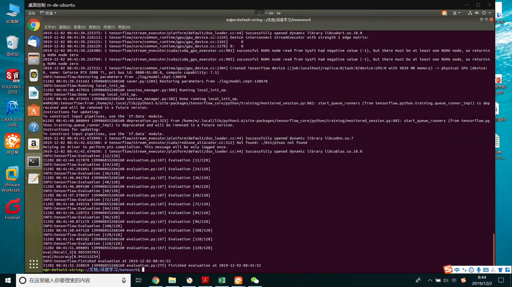
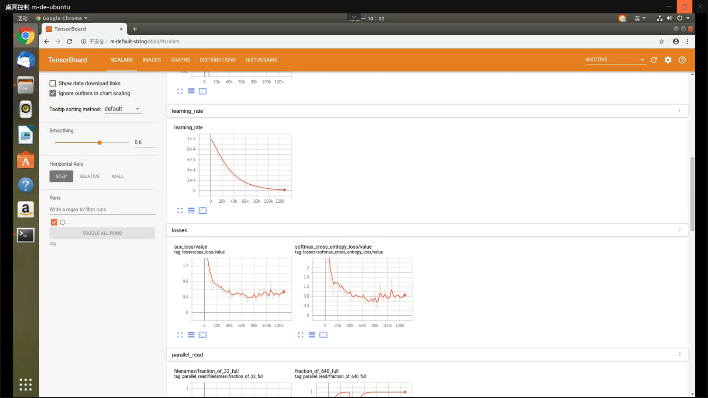

# 第十一周作业

## 1.部分踩坑心得

​       首先是使用GPU训练卡死的问题，困扰了我小一个月之久，网上找不到和我相同的案例，所以一直自己摸索，索性现在终于跌跌撞撞走出来了，具体解决过程如下：

​      1.1首先根据网上的资料限制了GPU显存的占用比例，无效。

​      1.2打开机箱的侧盖，GPU运行温度控制在65-67℃左右,继续训练中卡死！！！！

​      1.3监控内存的占用32G内存占用在33%左右，十分健康，没毛病！

​      1.4怀疑是其他硬件问题，切换至win10烤机也没啥问题。。。

​      1.5怀疑是650w电源太小，造成显卡满载运行时功率突破最大值，造成除法过载保护断电重启，所以京东上买了海韵1000W的金牌电源，换电源后进行训练，依然卡死重启！！！！

​      1.6这时候已经三个周过去了。。。不能继续头铁了，退而求其次用CPU训练吧，感觉9700KF的CPU还能一战，此时戏剧性的一幕出现了，更改完参数后训练还未开始就卡死。。。，切换回GPU训练反复观察卡死的节点，发现大多数卡死都是发生在保存checkpoint的时间节点，因此严重怀疑是CPU问题。

​      1.7于是重启进入硬件设置，将intel的睿频关闭，重新测试启动，果然解决了问题。。。。。。。

最后总结Intel的睿频技术真的坑爹还是因为CPU体质疑是Tensorflow的源代码和超频转换的不兼容????总之是不深究了，先用起来。

## 2.运行log截图

accuracy=94.31%

top5 = 98.55%

## 3.流程

####  3.1数据准备

​     对于一个原生的数据集，首先我们需要尽可能的排出其中的错误照片或与标签不符的部分，保证模型不会被错误数据带偏，并且能够发现其内在规律时最好大致分类一下，方便进行标注、学习。其次对数据打包（针对HDD无法快速随机的读取），SSD读取速度不是问题的可以不打包。

​     以上数据就基本完成了准备。

#### 3.2模型训练

​    使用的课程提供的脚本进行训练，没什么好说的，目前只是照做，具体实现还需要仔细研究代码。

重点注意就是CPU的并行计算参数的设置。无GPU时设置为TRUE。

#### 3.3模型导出

#### 3.4模型使用

## 4.Tensorboard 图像解读

​      由于我发现训练没问题就去睡觉了，电脑跑了一宿，总共训练了130000个step。惊奇的发现后期loss反而剧烈波动，而且有所增大，应该是学习率衰减过小以后，造成梯度消失造成的?

由下图可以看出学习率趋于平缓的区间和loss剧烈别动的区间正好吻合。

