第四周作业
代码见.py源代码文件，本周太忙还没研究jupyter的使用，老师请见谅0.0

# 第一题
1.  对连续型特征，可以用哪个函数可视化其分布？（给出你最常用的一个即可），并根据代码运行结果给出示例。（10分） 
    用直方图+分布曲线：可以解析出资料的规则性，比较直观地看出产品质量特性的分布状态，对于资料分布状况一目了然，便于判断其总体质量分布情况，且日常应用比较多。
    
     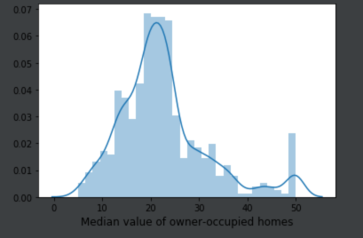
    [关于直方图](https://www.jianshu.com/p/844f66d00ac1)
    
2. 对两个连续型特征，可以用哪个函数得到这两个特征之间的相关性？根据代码运行结果，给出示例。（10分） 
    
    pandas.corr()这个函数计算相关系数，相关度越高值越大。如果是想要直观的看到相关性的话，那就是散点图，matplotlib的scatter()，还有seaborn的joinplot()方法。
    下图为相关系数值的heat，散点图scatter函数呈现的相关性，在平均房间数与房价之间还是有这比较明显的线性关系的。
    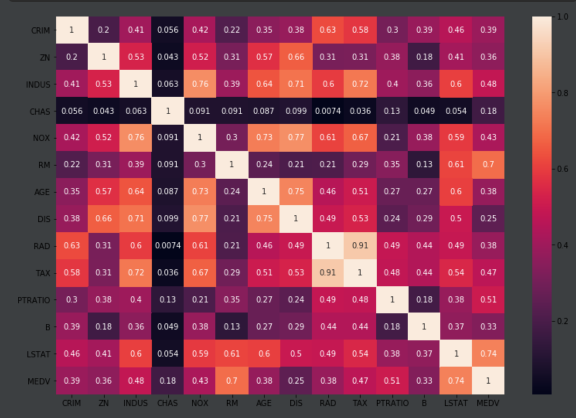   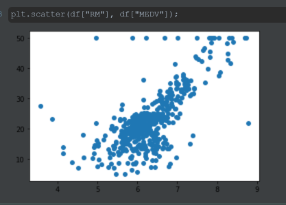
    [corr](https://blog.csdn.net/weixin_36372879/article/details/80899312)

3. 如果发现特征之间有较强的相关性，在选择线性回归模型时应该采取什么措施。（10分） 
    
    ​        增加L2正则，岭回归。本身较强相关性的话就不需要更多的解释，L1正则就不怎么需要了，是线性回归系数收缩是L2正则的作用。

4. 当采用带正则的模型以及采用随机梯度下降优化算法时，需要对输入（连续型）特征进行去量纲预处理。课程    代码给出了用标准化（StandardScaler）的结果，请改成最小最大缩放（MinMaxScaler）去量纲 （10分），并重新训练最小二乘线性回归、岭回归、和Lasso模型（30分）。 
    
    ​        在StandardScaler中均值0，方差1（这代表会有负数），minmaxscaler则是0-1，不一样。
    上图为33个随机种子，下图为23个随机种子，这随机影响还是很大的。
    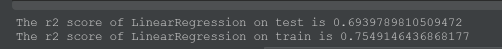 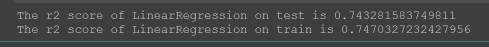
    ​        下图中，残差分布在-0.1到0之间占绝对优势，还是可以的，但是散点图和参考差太多了。因为minmax的值范围，所以缩小坐标系。。。
    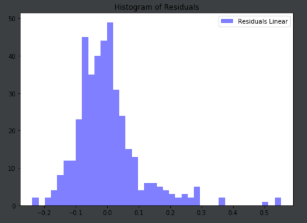 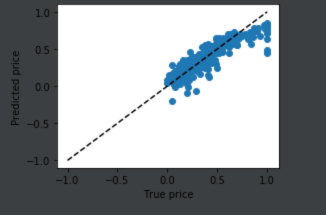
    岭回归
    岭回归中，训练和验证差不多。和参考也差不多
    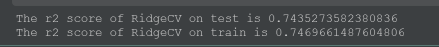
    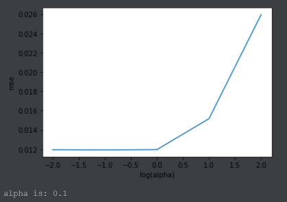
    lasso
    曲线图如图，奇怪的是λ的显示，另外，最优化果然很有必要。
    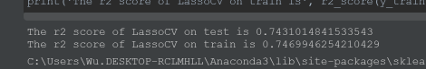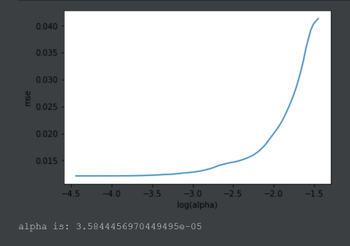
    
5. 代码中给出了岭回归（RidgeCV）和Lasso（LassoCV）超参数（alpha_）调优的过程，请结合两个最佳模型以及最小二乘线性回归模型的结果，给出什么场合应该用岭回归，什么场合用Lasso，什么场合用最小二乘。（30分） 
    
    本题听天由命持续懵逼！！！
    参考中给的超参数调优是在有限个中计算出最佳的λ（默认交叉验证）。
    数据点多于变量个数，没有多重共线性，计算方程组的最小二乘解?。
    岭回归用于处理下面两类问题：（在原先的A的最小二乘估计中加一个小扰动λI，是原先无法求广义逆的情况变成可以求出其广义逆，使得问题稳定并得以求解）
    1.数据点少于变量个数
    2.变量间存在共线性（最小二乘回归得到的系数不稳定，方差很大）
    同时，λ这东西本身对于L2正则来说，就没办法太大吧，平方的数在偏差较大的时候会得到非常大的值，想要取得总和最小，λ必然要和方差有一个系数上的对应？
    lasso
    当输入特征多，有些特征与目标变量之间相关性很弱时， L1正则可 能只选择强相关的特征，模型解释性好。 L1正则容易取得0的解，这样可以筛选变量。
    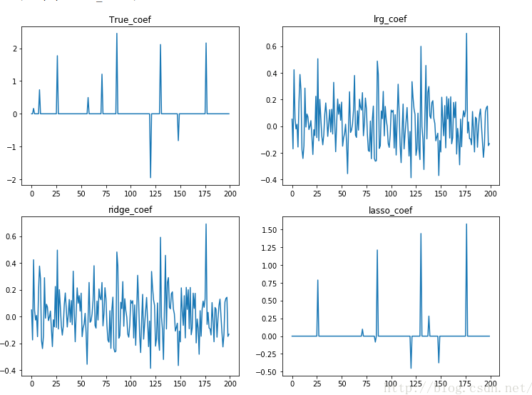